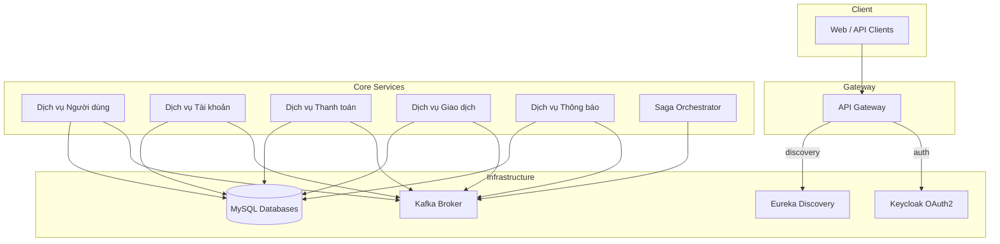
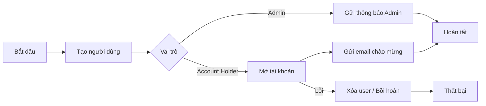
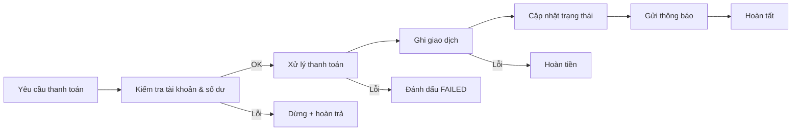

# Nền tảng saga-microservices-banking-mvp

Nền tảng ngân hàng theo mô hình dịch vụ (BaaS) được xây dựng bằng kiến trúc microservice Spring Boot và phối hợp giao dịch bằng mẫu **saga**. README này giúp bạn hiểu nhanh hệ thống làm gì, cách các dịch vụ giao tiếp, và vì sao saga bảo đảm tính nhất quán cho các nghiệp vụ ngân hàng.

## Tổng quan kiến trúc



### Công nghệ cốt lõi
- **Spring Boot 3 / Java 21**: mỗi microservice đóng gói nghiệp vụ riêng.
- **Maven multi-module** với `common-lib` chứa entity, event, command dùng chung.
- **Spring Cloud Gateway + Eureka**: định tuyến, cân bằng tải và đăng ký dịch vụ.
- **Apache Kafka + Spring Cloud Stream**: kênh sự kiện bất đồng bộ giữa các dịch vụ.
- **MySQL 8**: mỗi dịch vụ sở hữu schema riêng, đảm bảo độc lập dữ liệu.
- **Keycloak**: xác thực OAuth2/OIDC, RBAC.
- **Docker Compose**: chạy toàn bộ hạ tầng và dịch vụ tại môi trường local.

### Bố cục repo

| Thư mục | Chức năng |
| --- | --- |
| `api-gateway/` | Điểm vào duy nhất, kiểm tra JWT, gom dashboard quản trị |
| `service-discovery/` | Eureka Server theo dõi đăng ký/health check |
| `saga-orchestrator-service/` | Điều phối saga, lưu trạng thái, phát lệnh bồi hoàn |
| `user-service/` | Onboarding người dùng, phân quyền, phát sự kiện `UserCreated` |
| `account-service/` | Mở tài khoản, kiểm tra số dư, xác thực nguồn tiền |
| `payment-service/` | Xử lý thanh toán, cập nhật trạng thái, phát lệnh hoàn trả |
| `transaction-service/` | Ghi sổ kép, lưu lịch sử giao dịch |
| `notification-service/` | Gửi email/sự kiện thông báo |
| `common-lib/` | DTO, command, event và lớp trừu tượng saga |
| `config/`, `docker-compose.yml` | Cấu hình tập trung và dàn dựng hạ tầng |

## Thiết kế Saga

Trọng tâm của dự án là framework saga trừu tượng trong `common-lib`, được thực thi bởi `saga-orchestrator-service`.

- **Saga Instance**: mỗi workflow tạo bản ghi có trạng thái `STARTED/IN_PROGRESS/COMPLETED/FAILED`.
- **Saga Step**: định nghĩa command chính và command bồi hoàn khi thất bại.
- **Events & Commands**: truyền qua Kafka với ID tương quan để lần vết.
- **Compensation**: mọi bước đều có hành động hoàn tác đảm bảo dữ liệu đồng bộ giữa các dịch vụ.

### Vòng đời saga
1. **Start** – Client gửi request tới API Gateway; orchestrator tạo instance và phát command đầu tiên.
2. **Progress** – Dịch vụ tiêu thụ command, chạy nghiệp vụ, phát event thành công/thất bại.
3. **Transition** – Orchestrator lắng nghe event, quyết định bước kế tiếp hoặc kích hoạt bồi hoàn.
4. **Complete** – Kết quả cuối cùng được ghi log và dịch vụ thông báo gửi email/alert.

### Saga Onboarding người dùng



- `user-service` lưu người dùng và phát `UserCreated`.
- `account-service` tạo tài khoản cho người dùng thường, phát `AccountCreated` hoặc `AccountCreationFailed`.
- `notification-service` gửi email bằng event `NotificationRequested`.
- Bồi hoàn: khi mở tài khoản lỗi, orchestrator phát `DeleteUserCommand` để xóa user vừa tạo.

### Saga xử lý thanh toán



- `account-service`: xác minh số dư để ngăn request lỗi đi tiếp.
- `payment-service`: giữ tiền, phát `PaymentProcessed/PaymentFailed`.
- `transaction-service`: ghi sổ, bảo đảm idempotent.
- `notification-service`: cập nhật khách hàng về kết quả.
- Bồi hoàn: orchestrator tự động trả tiền lại, chỉnh trạng thái và gửi thông báo thất bại.

### Quy ước messaging
- Tên topic: `<service>.<domain>.<event>` giúp phân tách trách nhiệm.
- Payload luôn kèm `sagaInstanceId` và correlation ID.
- Spring Cloud Stream binding chuẩn hóa producer/consumer.
- OpenTelemetry giúp nối log/trace giữa dịch vụ và saga.

## Cách chạy hệ thống

1. **Docker Compose (đầy đủ hạ tầng + dịch vụ)**
   ```bash
   ./start-docker-compse.sh
   ```
   Script sẽ dừng container cũ, build Maven, sau đó `docker-compose up -d`.

2. **Chạy thủ công**
   ```bash
   ./start-infra.sh          # Kafka, MySQL, Keycloak, v.v.
   ./start-springboot-services.sh
   ```

3. **Điểm truy cập**
   - API Gateway: `http://localhost:8080`
   - Eureka Dashboard: `http://localhost:8761`
   - Keycloak: `http://localhost:8180`

## Quan sát & mở rộng
- OpenTelemetry agent ghi trace/span ID trong log từng dịch vụ.
- Orchestrator cung cấp API `/api/saga/instances` (chỉ admin) để theo dõi tiến trình.
