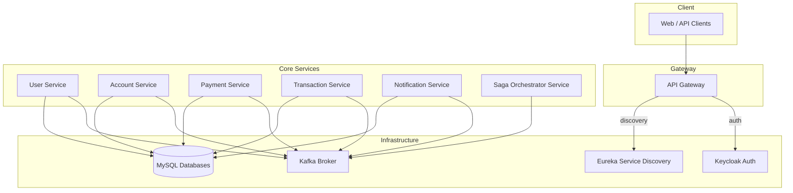
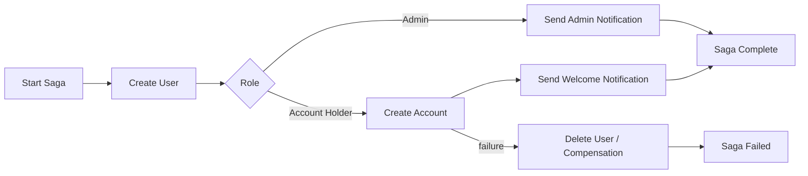
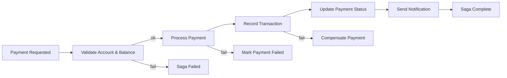

# saga-microservices-banking-mvp


Saga-microservices-banking-mvp demonstrates a production-grade, saga-orchestrated banking platform built on Spring Boot microservices with shared observability, messaging, and security infrastructure.

## High-Level Architecture



### Technology Stack
- **Spring Boot 3 / Java 21** for each microservice
- **Maven** multi-module build with a shared `common-lib`
- **Spring Cloud** components for Gateway and Eureka discovery
- **MySQL 8** per service schema
- **Apache Kafka + Spring Cloud Stream** for event-driven communication
- **Keycloak** for OAuth2 / OpenID Connect authentication
- **Docker Compose** for local orchestration

### Repository Layout

| Path | Description |
| --- | --- |
| `api-gateway/` | Spring Cloud Gateway entry point with routing, auth and admin aggregation |
| `service-discovery/` | Eureka server for service registry and health monitoring |
| `saga-orchestrator-service/` | Central orchestrator implementing abstract saga logic |
| `user-service/` | User onboarding, roles, and credential management |
| `account-service/` | Account lifecycle, balance checks, and payment validation |
| `payment-service/` | Payment lifecycle, status management, compensation triggers |
| `transaction-service/` | Ledger entries and transaction history |
| `notification-service/` | Event-driven email notifications |
| `common-lib/` | Shared entities, events, commands, and saga abstractions |
| `config/` | Centralized configuration files |
| `docker-compose.yml` | Local deployment of infra + services |

## Saga Pattern Design

The platform uses an **abstract saga orchestration framework** housed in `common-lib` and executed by `saga-orchestrator-service`. Key concepts:

- **Saga Instance** – State persisted per workflow with lifecycle states (`STARTED`, `IN_PROGRESS`, `COMPLETED`, `FAILED`).
- **Saga Steps** – Declarative steps mapped to service commands and compensations.
- **Events & Commands** – Typed messages published via Kafka topics for each step transition.
- **Compensation Logic** – Automatic rollback functions attached to each step to maintain consistency.

### Lifecycle
1. **Start** – Client request hits API Gateway -> orchestrator creates saga instance and emits first command.
2. **Progress** – Services consume commands, execute business logic, and emit domain events on success/failure.
3. **Transition** – Orchestrator listens for events, advances to next step or triggers compensation.
4. **Completion** – Final state recorded and notification service informs stakeholders.

### User Onboarding Saga



- **Create User** (`user-service`) persists the profile and emits `UserCreated`.
- **Account Creation** (`account-service`) opens default account for non-admin users and emits `AccountCreated` or `AccountCreationFailed`.
- **Notifications** (`notification-service`) email confirmations via `NotificationRequested` events.
- **Compensation** – If account creation fails, orchestrator triggers `DeleteUserCommand` to rollback the initial step.

### Payment Processing Saga



- **Validation** (`account-service`) ensures sufficient funds; emits failure to short-circuit.
- **Processing** (`payment-service`) reserves/debits funds and emits `PaymentProcessed` or `PaymentFailed`.
- **Transaction Recording** (`transaction-service`) generates ledger entries and ensures idempotency.
- **Status + Notification** – Payment service finalizes status; notification service informs user.
- **Compensation** – On downstream failure, orchestrator issues compensating commands (refund, status update, send failure email).

### Messaging Contracts
- Topics follow the pattern `<service>.<domain>.<event>`.
- Messages contain correlation IDs and saga instance IDs for traceability.
- Each service implements both command handlers and event emitters using Spring Cloud Stream bindings.
- OpenTelemetry tracing is enabled across services to join log spans with saga IDs.

## Running the Platform

1. **Start everything via Docker Compose**
   ```bash
   ./start-docker-compose.sh
   ```
   This script stops existing containers, builds all services with Maven, and launches the full stack.

2. **Manual mode** (infrastructure first, services locally):
   ```bash
   ./start-infra.sh
   ./start-springboot-services.sh
   ```

### Runtime Notes & Startup Order

`./start-docker-compose.sh` builds every service image and attempts to launch the full stack. On the latest run, Kafka (`broker`) and Keycloak started successfully, but the MySQL container failed to bind to `0.0.0.0:3306` because that port is already occupied on the host. Stop the host MySQL instance (or change the port mapping in `docker-compose.yml`) before re-running the script so that the remaining services can start cleanly.

When starting services manually, use this dependency-friendly order:

1. **Infrastructure** – MySQL, Kafka broker, and Keycloak (via `./start-infra.sh` or Compose) so databases, messaging, and auth are ready.
2. **Service Discovery** – bring up `service-discovery` (Eureka) so other services can register.
3. **API Gateway** – start `api-gateway` to handle routing and authentication once discovery is live.
4. **Core Domain Services** – start `user-service`, `account-service`, `payment-service`, `transaction-service`, and `notification-service` in that order; they depend on the infrastructure and each other for saga steps.
5. **Saga Orchestrator** – start `saga-orchestrator-service` last so all command consumers are already running when sagas emit events.

Following this sequence mirrors what `./start-springboot-services.sh` and Compose do automatically and avoids `port already in use` errors (for example, port 8761 for Eureka or 8080 for gateway) because each component waits for its prerequisites.

## Observability
- OpenTelemetry Java agent attached to each service prints trace/span IDs in logs.
- Saga orchestrator exposes `/api/saga/instances` for real-time monitoring (admin-only).
- Docker logs can be tailed per service: `docker-compose logs -f <service>`.

## Next Steps
- Extend saga definitions in `saga-orchestrator-service` to cover new workflows (e.g., loan applications).
